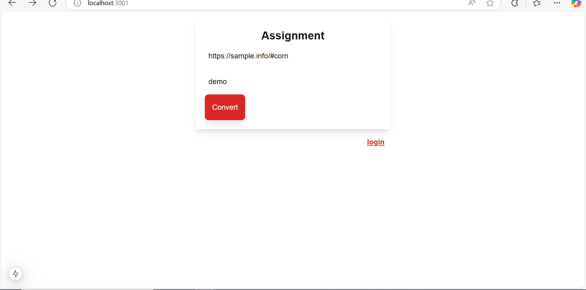
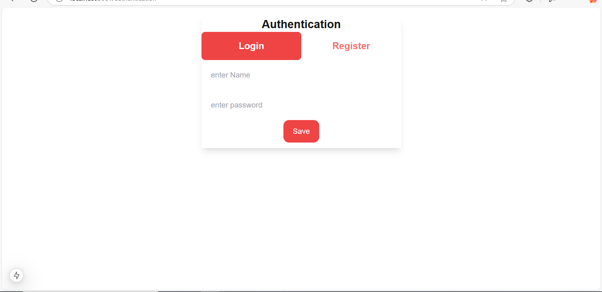
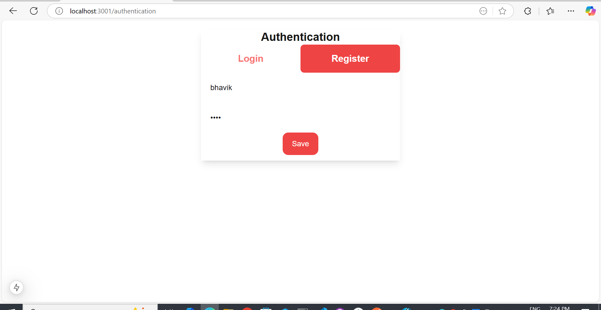
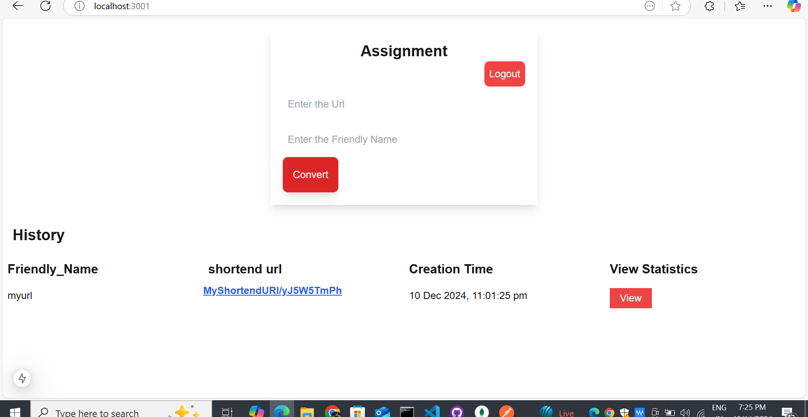
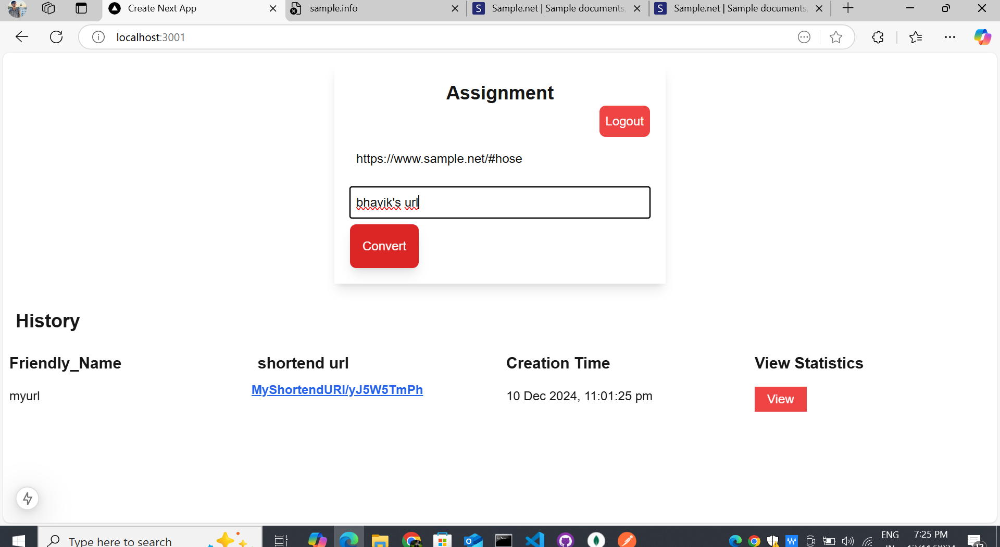
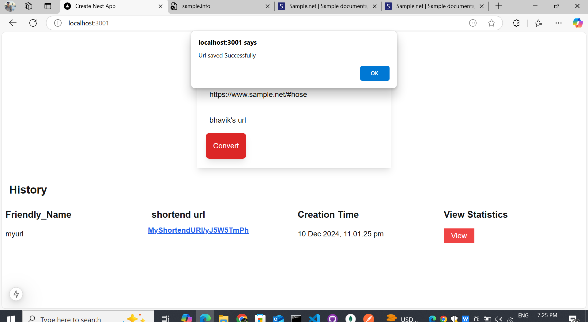
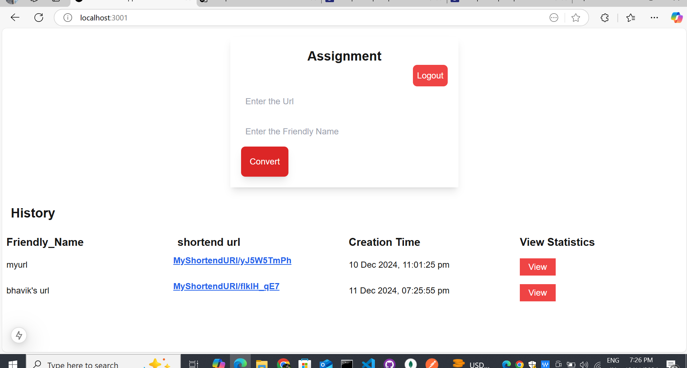
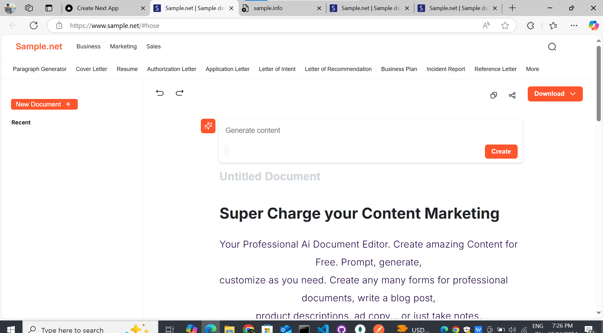
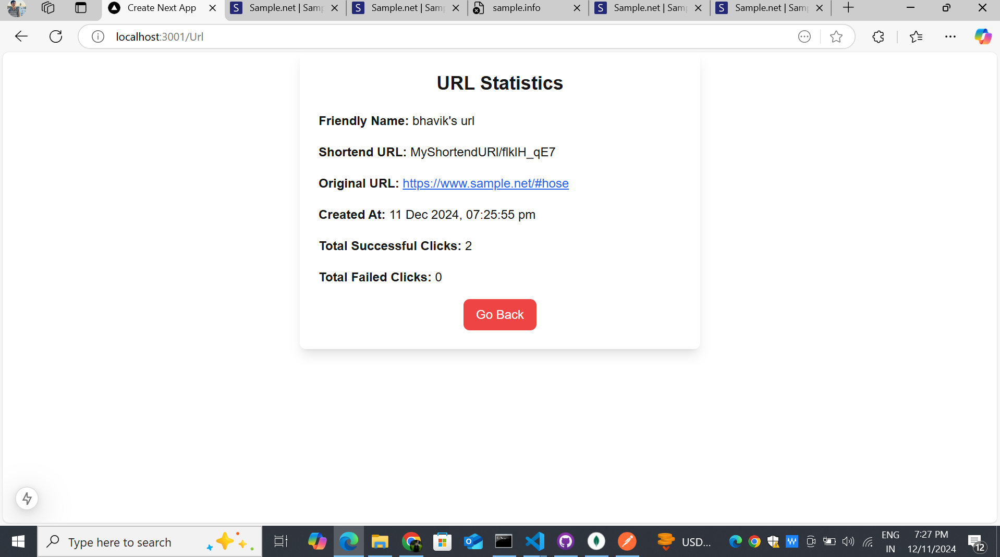

This is a [Next.js](https://nextjs.org) project bootstrapped with [`create-next-app`](https://github.com/vercel/next.js/tree/canary/packages/create-next-app).

## Getting Started

First, run the development server:

```bash
npm run dev
# or
yarn dev
# or
pnpm dev
# or
bun dev
```

Open [http://localhost:3000](http://localhost:3000) with your browser to see the result.

You can start editing the page by modifying `app/page.js`. The page auto-updates as you edit the file.

This project uses [`next/font`](https://nextjs.org/docs/app/building-your-application/optimizing/fonts) to automatically optimize and load [Geist](https://vercel.com/font), a new font family for Vercel.
### Few Screenshots


If a user attempts to generate a shortened link without being logged in, the link will not be generated, and the user will be redirected to the authentication page to log in.



After a successful login or registration, a token is generated and stored in the user's cookies using the js-cookie library for session management.


Users can view their URL generation history and generate new shortened links. Each request to the server includes the token in the header using React Query for authentication. Once the token is verified, the data is securely stored in the database.



When a user clicks on a shortened link, each successful and failed request is recorded in the database. Users can view the request statistics, including success and failure counts, for each link.




## Learn More

To learn more about Next.js, take a look at the following resources:

- [Next.js Documentation](https://nextjs.org/docs) - learn about Next.js features and API.
- [Learn Next.js](https://nextjs.org/learn) - an interactive Next.js tutorial.

You can check out [the Next.js GitHub repository](https://github.com/vercel/next.js) - your feedback and contributions are welcome!


